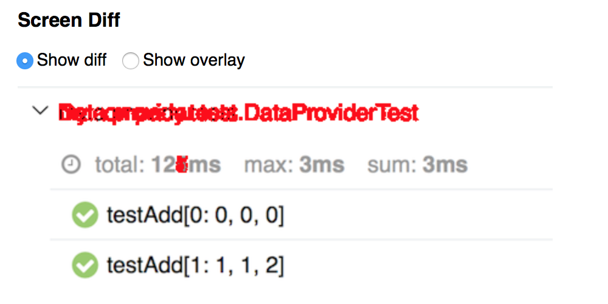
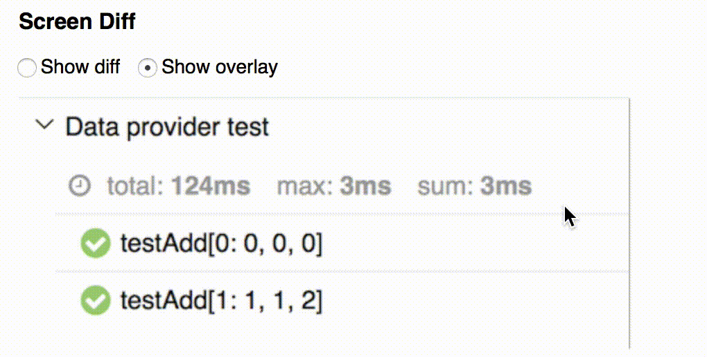

# Project: Screen Diff Example
## Technologies:
- Java
- Maven
- Selenide
- TestNG
- Allure
- Screen Diff Plugin
 
### Show diff view



### Show overlay view



## Follow the link and read the documentation to get Allure:
- https://github.com/allure-framework/allure2
## Run tests with command:
```
mvn clean test
```
## Then serve allure report with screen diff plugin:
```
cd target
allure serve
```
